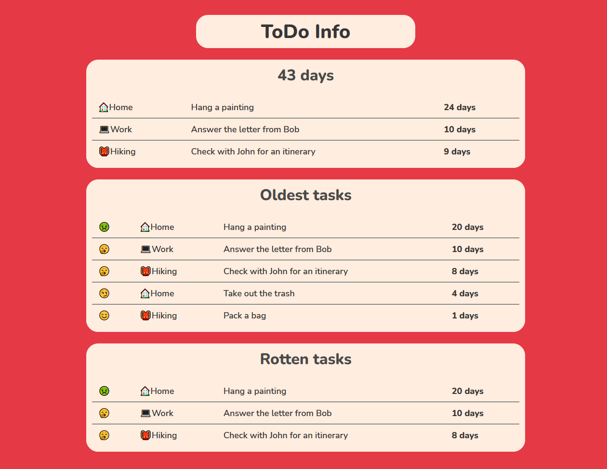

# ToDo Info

**ToDo info** helps you find old tasks from Microsoft ToDo.

It calculates the age of tasks (measure in days) and sets a category for every task:
* 😊 - new task
* 😏 - normal task
* 🥱 - old task
* 🤢 - very old task

The main page shows:
* Sum of ages for all tasks
* Sum of ages for each list
* The five oldest task
* Rotten tasks. This is a list with 🥱🤢 task